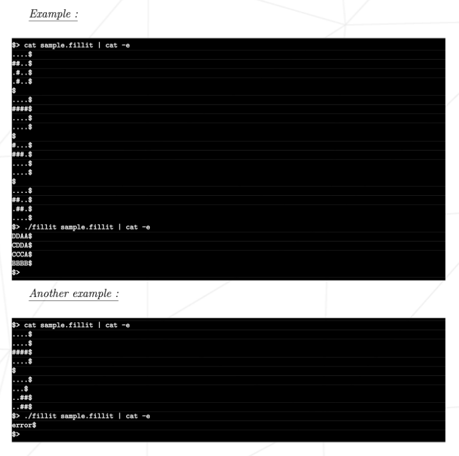

# Fillit
Fillit is a program that takes a [file](https://github.com/Nicennn/42_Fillit/tree/master/tests) in parameter that contains tetriminos and arranges them in the smallest square possible.
## Rules
We must follow the norm imposed by 42 and only use the following libc functions:
* exit
* open
* close
* write
* read
* malloc
* free

Only valid files will be executed:

## How to execute
Run: `
./fillit tests/test_file
`  
If you prefer, run `make re` at the root of the file to recompile an executable and run the previous line.  If the the file was valid, your output will look similar to this:

If the file was invalid, an error message will appear.
