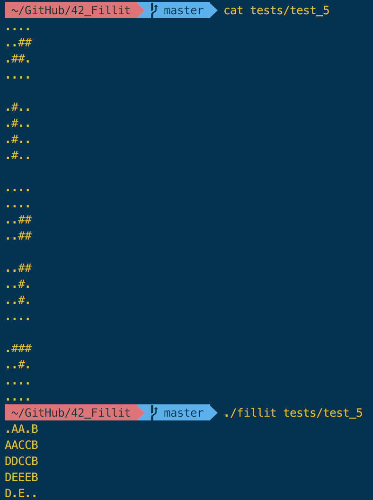
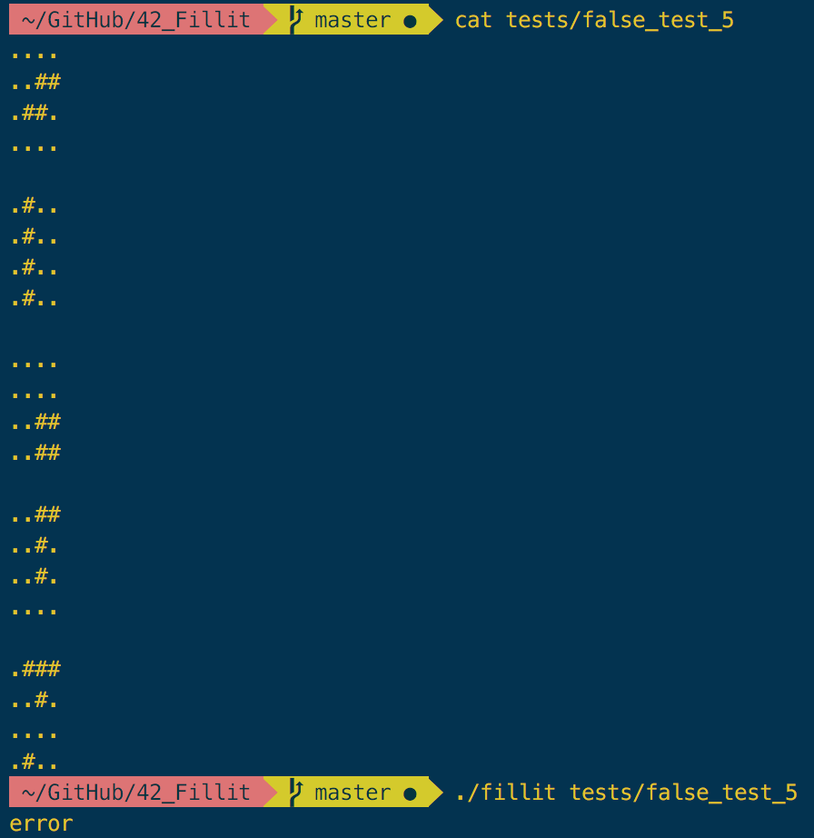

# Fillit
Fillit is one of the first projects available during the 42 curriculum. The goal is to write a program that takes a [file](https://github.com/Nicennn/42_Fillit/tree/master/tests) in parameter that contains [tetriminos](https://en.wikipedia.org/wiki/Tetromino) and arranges them in the smallest square possible. My answer to this was a backtracking algorithm.
## Rules
We must follow the [norm](https://github.com/Nicennn/42_Fillit/blob/master/imgs/Norm_42.pdf) imposed by 42 and only use the following libc functions:
* exit
* open
* close
* write
* read
* malloc
* free

Only valid files will be executed:


## Usage
Run: `
./fillit tests/test_file
`  
If you prefer, run `make re` at the root of the file to recompile an executable and run the previous line.  If the file was valid, your output will look similar to this:



If the file was invalid, an error message will appear:



## Algorithm
### Checker program
As it's name suggests, this program checks if the file passed in argument is valid or not by checking at [x +/- 1] and [y +/- 1] coordonates if a '#' block is present or not and if the number of total blocks is equal to 4. This part was mostly handled by my partner [h4cke2man](https://github.com/h4cke2man).
```c
static int	ft_checkbloc(char *line, int bloc[5])
{
	int		i;
	int		start;
	int		isintouch;

	i = -1;
	isintouch = 0;
	start = bloc[0];
	while (line[++i])
	{
		if (line[i] == '#')
		{
			if (bloc[0] != start && line[i - 1] != '#')
				return (1);
			if (bloc[i + 1] == 1)
				isintouch = 1;
			bloc[0]++;
			bloc[i + 1] = 1;
		}
		else
			bloc[i + 1] = 0;
		if (bloc[0] > 4)
			return (1);
	}
	return ((isintouch != 1 && start > 0 && start < 4 ? 1 : 0));
}
```
### Backtracking algorithm
The backtracking algorithm tries every possible correct square with every tetrimino available by starting with a 2x2 map. If the square is too small, we create a new 3x3 map, and so on until the smallest square possible is filled.
```c
static int	solver(char **map, t_tetriminos *tetri, int size, int tetnb)
{
	int		x;
	int		y;

	y = 0;
	if (tetri->lettre < 'A' || tetri->lettre > 'Z')
		return (1);
	while (y <= size - tetri->height)
	{
		x = 0;
		while (x < size)
		{
			if (verif(tetri, map, x, y))
			{
				if (solver(map, tetri + 1, size, tetnb))
					return (1);
				else
					tetri_del(tetri, map, x, y);
			}
			x++;
		}
		y++;
	}
	return (0);
}
```
This can be optimised with a more complex algorithm and bit masking, update in the works!
